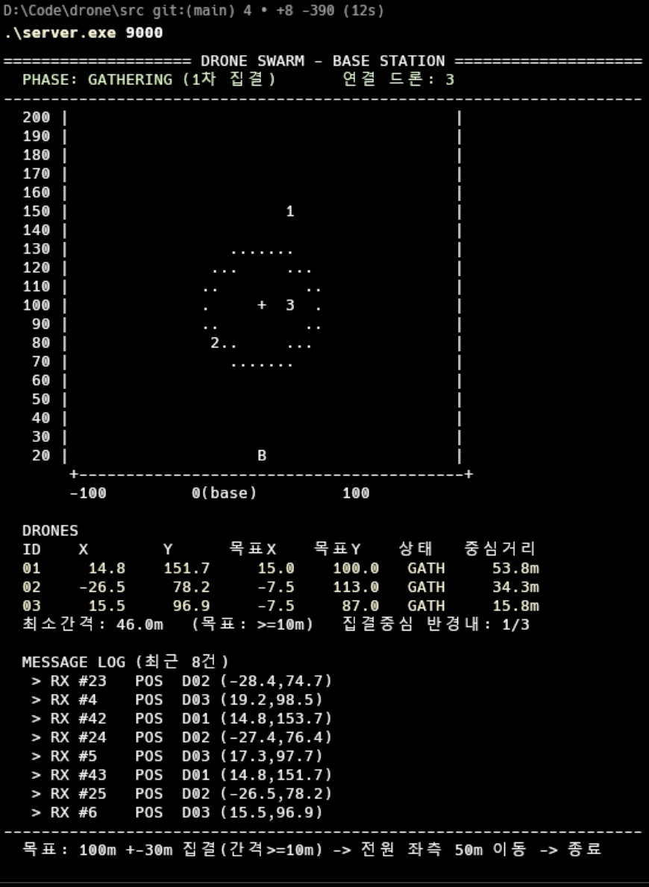

# 드론 군집 제어 시스템 (Drone Swarm Control System)




TCP 기반 **다중 쓰레드 기지국 서버**가 **N(≥3)대의 드론 클라이언트**를
**1차 이동(군집 집결)** → **2차 이동(일괄 좌측 50m)** → **종료** 순으로 제어하는
분산 제어 시스템. C / Winsock 2.2, 『열혈 TCP/IP』 Ch.20 멀티쓰레드 예제 기반.

## 구성

```
                  기지국 서버 (server.c)
   ┌──────────────────────────────────────────────────┐
   │  Acceptor(main)  ── 연결당 ──▶  DroneHandler ×N    │
   │  ControlLoop : 페이즈 관리 + MOVE_CMD 유니캐스트    │
   │  RenderLoop  : 레이더/상태표/메시지로그 실시간 렌더 │
   └──────────────────────────────────────────────────┘
        ▲ TCP          ▲ TCP          ▲ TCP
   ┌────┴────┐    ┌────┴────┐    ┌────┴────┐
   │ drone#1 │    │ drone#2 │    │ drone#3 │
   └─────────┘    └─────────┘    └─────────┘
```

- [`src/protocol.h`](src/protocol.h) — 공유 메시지 구조체·상수
- [`src/server.c`](src/server.c) — 기지국 서버 (쓰레드 4종: accept / 드론별 수신 / 제어 / 렌더)
- [`src/drone.c`](src/drone.c) — 드론 클라이언트 (쓰레드 2종: 보고 송신 / 명령 수신)

## 빌드 & 실행 (Windows)

```bat
cd src
gcc server.c -o server.exe -lws2_32
gcc drone.c  -o drone.exe  -lws2_32
```

```bat
REM 서버 (포트 9000)
server.exe 9000

REM 드론 3대 이상 (각각 다른 콘솔)
drone.exe 127.0.0.1 9000 D1
drone.exe 127.0.0.1 9000 D2
drone.exe 127.0.0.1 9000 D3
```

이후 모든 단계(집결 → 좌측 50m 이동 → 종료)는 자동 진행되며,
서버 콘솔에 **레이더 / 상태표 / 메시지 로그** 3패널이 실시간 표시됩니다.
MSVC 빌드 등 상세는 [`src/README.md`](src/README.md) 참조.

## 문서

- [프로젝트 설명.pdf](assets/프로젝트%20설명.pdf) — 과제 명세
- [프로젝트 결과보고서.pdf](프로젝트%20결과보고서.pdf) — 최종 결과 보고서
- [DESIGN_SPEC.md](assets/DESIGN_SPEC.md) — 아키텍처·프로토콜·알고리즘 상세
- [src/README.md](src/README.md) — 빌드/실행 상세 가이드
